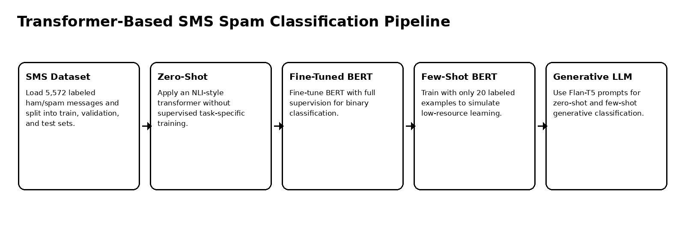
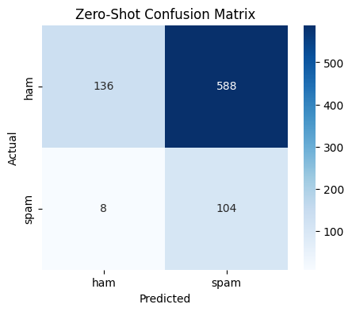
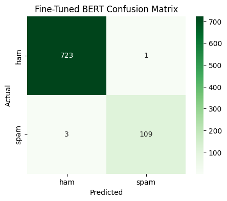
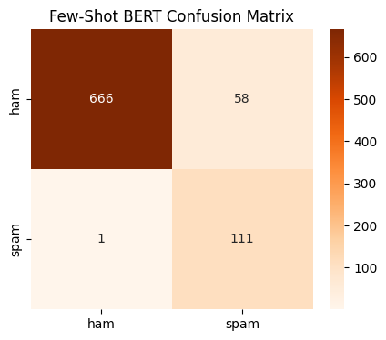
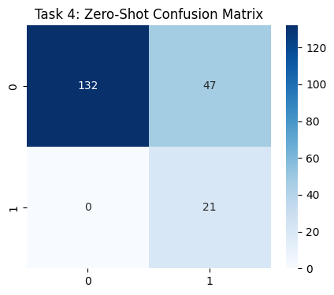
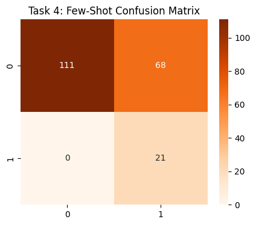
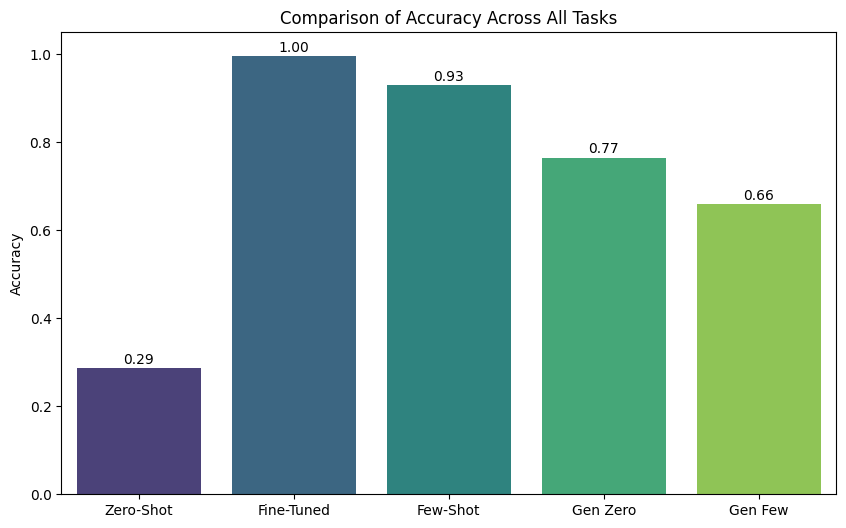

# SMS Spam Classification with Transformers

Transformer-based text classification workflow comparing zero-shot classification, fine-tuned BERT, few-shot BERT, and Flan-T5 generative prompting on the SMS Spam dataset.

## Overview

This project studies multiple transformer strategies for SMS spam detection. It compares direct zero-shot classification, full supervised fine-tuning, few-shot training, and generative prompt-based classification.

The project is useful because it shows that transformer performance depends heavily on task framing, label wording, and the amount of supervised data.

## Dataset

| Item | Details |
|---|---|
| Dataset | SMS Spam Collection |
| Messages | 5,572 |
| Labels | Ham, Spam |
| Train size | 3,900 |
| Validation size | 836 |
| Test size | 836 |

## Modeling Pipeline



## Methods Compared

| Method | Setup | Accuracy |
|---|---|---:|
| Zero-shot transformer | NLI-style zero-shot classification | 0.2871 |
| Fine-tuned BERT | Full supervised fine-tuning | 0.9952 |
| Few-shot BERT | 20 labeled training examples | 0.9294 |
| Flan-T5 zero-shot | Generative prompt classification on 200-sample subset | 0.7650 |
| Flan-T5 few-shot | In-context examples on 200-sample subset | 0.6600 |

## Interpretation

Fine-tuned BERT achieved the best result with 99.52% accuracy and near-perfect class-level scores. Few-shot BERT also performed strongly despite using only 20 labeled examples, showing that pre-trained transformers can adapt quickly when the task format is clear.

The weakest result came from zero-shot NLI classification. The main issue was semantic label ambiguity: the label **ham** is not naturally understood by generic NLI models as “not spam,” so the model over-predicted spam.

The Flan-T5 experiments showed that generative classification can work reasonably well, but prompt design and output parsing matter significantly.

## Visual Summary

| Zero-shot transformer | Fine-tuned BERT | Few-shot BERT |
|---|---|---|
|  |  |  |

| Flan-T5 zero-shot | Flan-T5 few-shot | Accuracy comparison |
|---|---|---|
|  |  |  |

## Key Findings

1. Full fine-tuning remains the strongest approach when labeled data is available.
2. Few-shot BERT can perform very well with limited examples.
3. Zero-shot classification is sensitive to label wording and domain meaning.
4. Generative LLM classification requires careful prompting and output normalization.

## Repository Contents

```text
.
├── sms_spam_transformer_classification.ipynb
├── docs/
│   └── figures/
├── requirements.txt
├── .gitignore
└── README.md
```

## Run Locally

This repository is notebook-based. Create a clean Python environment, install the dependencies, then open the notebook.

### Windows PowerShell

```powershell
py -3.10 -m venv .venv
.\.venv\Scripts\Activate.ps1
python -m pip install --upgrade pip
pip install -r requirements.txt
```

### Linux / macOS

```bash
python3 -m venv .venv
source .venv/bin/activate
python -m pip install --upgrade pip
pip install -r requirements.txt
```


## Open the Notebook

```bash
jupyter notebook sms_spam_transformer_classification.ipynb
```

## Notes

The notebook may require a GPU runtime for fine-tuning transformer models efficiently.
